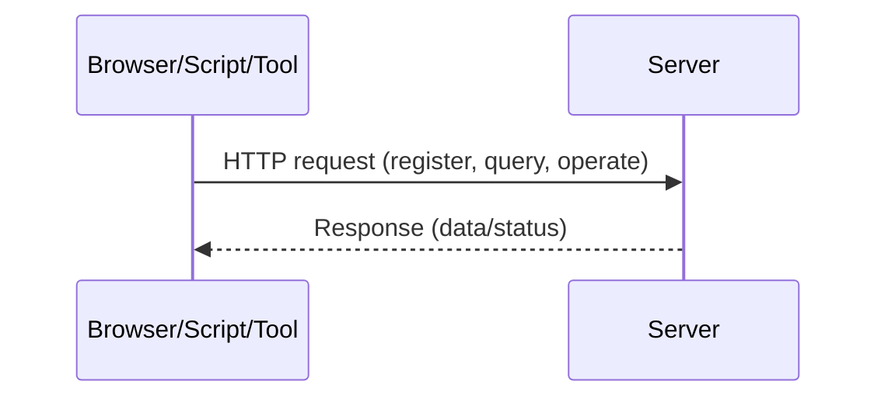
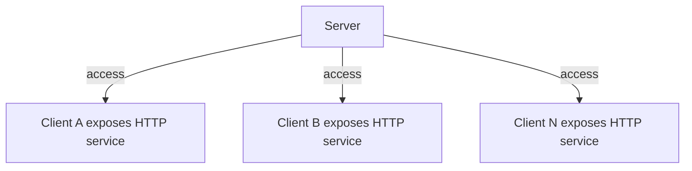
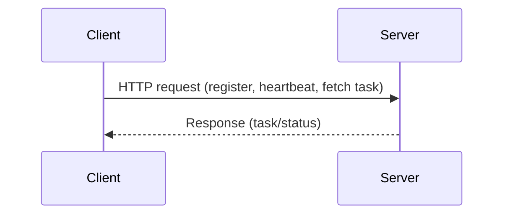
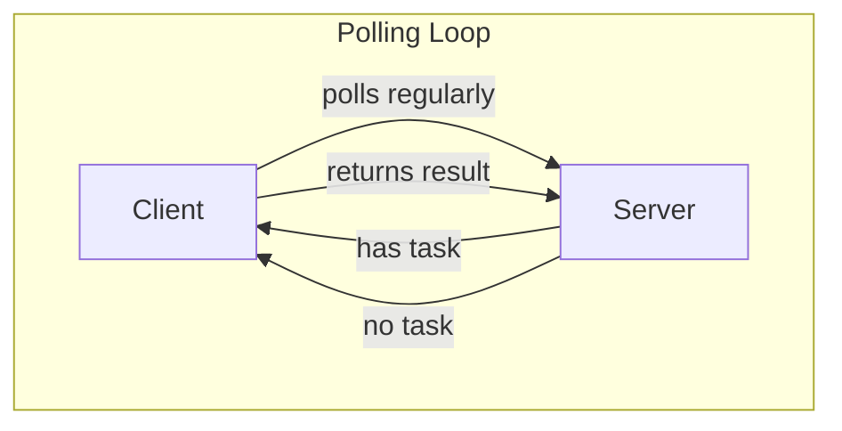
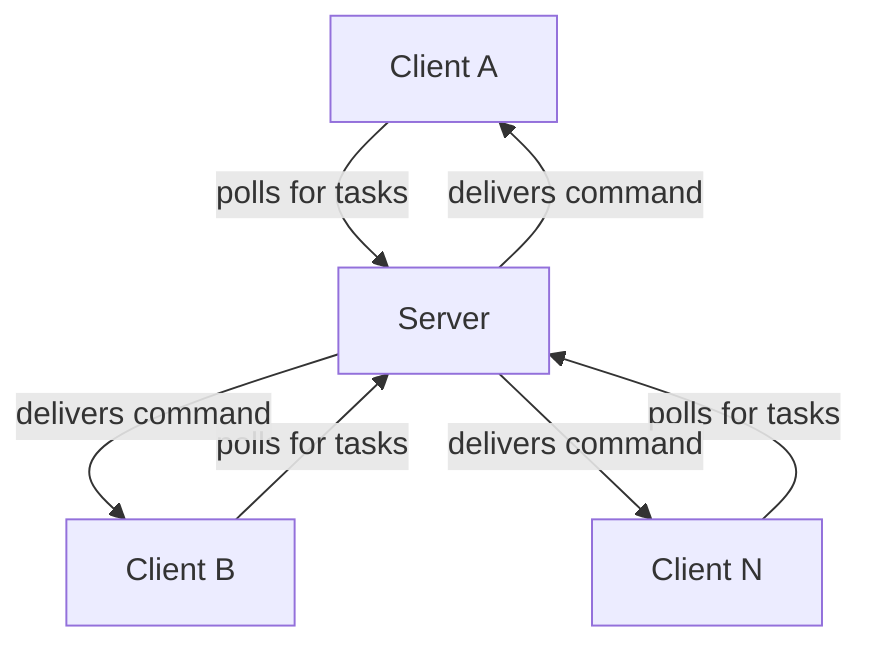

# orange-forge-agent: Reverse Communication Library

## Background

In a traditional B/S (Browser/Server) architecture, the server usually exposes HTTP APIs that can be accessed by browsers, command-line tools like CURL, or programming languages such as Python (using the requests library).

### Typical B/S Communication Flow



However, in DevOps and automated operations scenarios, the server often needs to actively send commands to many clients (for example, batch deployment, health checks, etc.). If every target machine exposes its own HTTP service for the platform to call, it becomes insecure and hard to manage. So, we need a communication component that allows the server to efficiently and securely send instructions to a cluster of clients.

### The Problem with Traditional Server-to-Client Command Delivery



> Every client must expose a port, which is insecure and hard to maintain.

### Typical Use Cases
- Batch deployment in DevOps tools
- Client health checks and status reporting
- Automated operations and batch task delivery
- Remote command execution

## Communication Approaches

To enable two-way communication between server and clients, there are two common approaches:

1. **Long Connection (e.g., WebSocket)**
   - Pros: Real-time, smooth communication with low latency.
   - Cons: Distributed deployment requires connection management, which is complex to develop and maintain, and hard to debug.

2. **HTTP Polling**
   - Pros: Simple to implement, easy to scale the server horizontally, no need for complex components, and easier to debug.
   - Cons: Real-time experience depends on polling frequency, so it may feel a bit laggy.

This library uses the second approach—**HTTP polling**—and provides a simple, high-level API for both server and client. You only need a few lines of code to build an efficient reverse communication service.

---

## Communication Flow Examples

### 1. Client Actively Calls the Server



### 2. Server Actively Sends Commands to Client (Polling Mode)



### Reverse Communication Flow with orange-forge-agent



> Clients do not need to expose any ports. All communication is initiated by the clients polling the server, making it secure and easy to maintain.

---

## Features

- **Reverse communication via HTTP polling:** No need for clients to expose ports; the server can send commands to clients.
- **Distributed friendly:** The server is stateless and easy to scale horizontally.
- **Highly abstracted:** Both server and client require only a few lines of code to integrate.
- **Easy to debug:** No complex connection management; issues are easier to track down.
- **Versatile:** Suitable for batch tasks, health checks, remote commands, and more.

---

## Installation

```bash
go get github.com/zhuCheer/orange-forge-connect
```

---

## Quick Start

### Server Example


For server-side implementation examples, please refer to example/gin-forg-server

```go

cd example/gin-forg-server
go mod tidy
go run main.go

```

The server requires Redis to be installed and running beforehand.
The core implementation involves binding the server API routes to HTTP routes.

```go
func BindForgeServer() gin.HandlerFunc {
	return func(c *gin.Context) {
		conn := redisPool.Get()
		defer conn.Close() // Must be closed after use, otherwise the connection will not be returned to the pool
		serverHttpHandler := ForgeServer.WithRdx(conn).Handler()

		// Convert gin context to standard http request and response
		serverHttpHandler.ServeHTTP(c.Writer, c.Request)
	}
}

```

### Client Example

```go
// Initialize the client
service.ForgeClient = forge_connect.NewForge("appid", "secret").
    SetDebug(true).
    SetServerAddr("http://127.0.0.1:8890")

// Register a callback function
_, _, err := service.ForgeClient.Regist(CallbackTask)
if err != nil {
    // Error handling
}

// Example callback function
func CallbackTask(task *forge_connect.Task) (result string) {
    logger.Infow("CallbackTask Run------------->", "task", task)
    if task == nil {
        return "not found task"
    }
    return "0000000000000000000"
}
```

---

## Typical Scenarios

- DevOps automation and operations
- Batch task delivery
- Client health checks
- Remote command execution

---

## Contributing

Issues and PRs are welcome! If you have suggestions or needs, feel free to submit them.

---

## License

MIT

---

For more details, please refer to the source code and comments.

