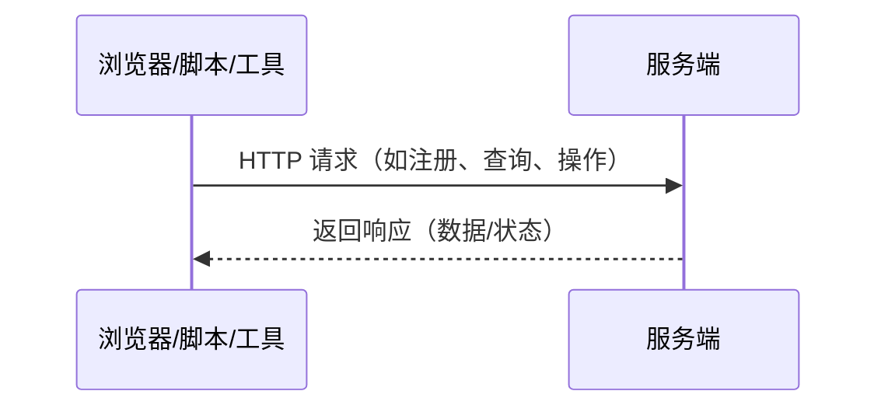
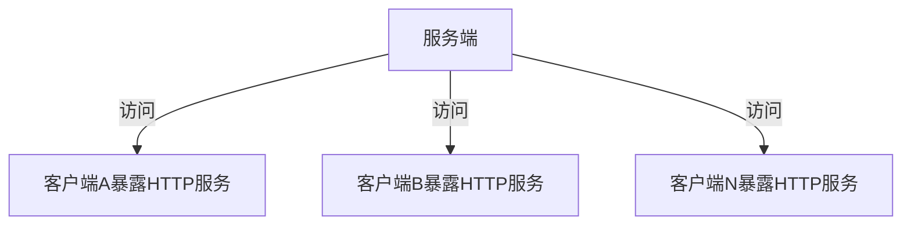
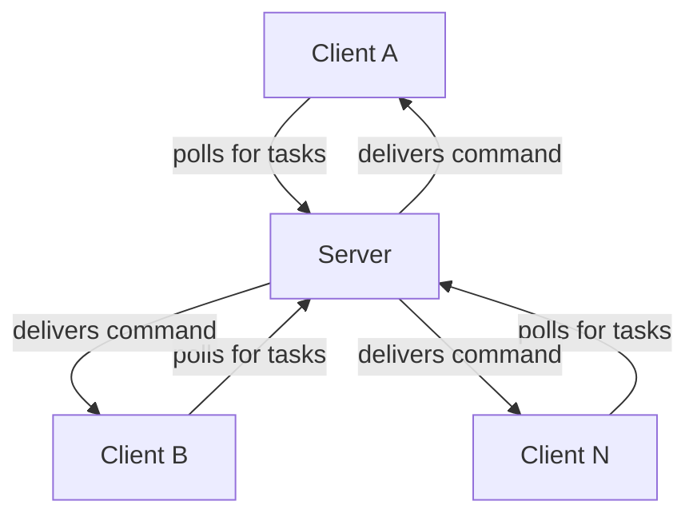

# orange-forge-agent 反向通信库

## 背景介绍

在传统的 B/S 架构中，服务端通常通过 HTTP 服务与浏览器、CURL、Python 等客户端进行通信，用户可以直接通过浏览器、命令行工具或编程语言的 HTTP 库（如 Python 的 requests）访问服务端接口。

### 传统 B/S 架构通信流程



然而，在 DevOps、自动化运维等场景下，常常需要服务端主动下发指令到大量客户端（如批量部署、健康检查等）。如果让每台目标机器都暴露 HTTP 服务供平台调用，既不安全也不现实。因此，我们需要一种能够从服务端高效、安全地下发指令到客户端集群的通信组件。

### 传统服务端主动下发指令的局限性



> 每台客户端都需暴露端口，安全性和可维护性差


### orange-forge-agent 反向通信流程



> 客户端无需暴露任何端口，所有通信均由客户端轮询服务端发起，安全且易于维护

---

### 典型场景
- DevOps 工具中的批量服务部署
- 客户端健康检查与状态上报
- 自动化运维批量任务下发
- 远程命令执行

## 通信方式对比

为实现服务端与客户端的双向通信，常见有两种方案：

1. **长连接（如 WebSocket）**
   - 优点：通信实时、流畅，信息传递延迟低。
   - 缺点：分布式部署需引入连接管理组件，开发和运维复杂，异常排查困难。

2. **HTTP 轮询**
   - 优点：实现简单，服务端易于分布式扩展，无需复杂组件，排查问题容易。
   - 缺点：通信实时性依赖轮询频率，体验略有顿挫。

本库采用第二种方案——**HTTP 轮询**，对服务端和客户端进行了高度封装，仅需简单调用即可实现高效的反向通信服务。

---

## 特性

- **HTTP轮询反向通信**：无需暴露客户端端口，服务端可主动下发指令
- **分布式友好**：服务端无状态，易于横向扩展
- **高度封装**：服务端、客户端均只需少量代码即可集成
- **易于排查**：无复杂连接管理，问题定位简单
- **适用广泛**：批量任务、健康检查、远程命令等

---

## 安装

```bash
go get github.com/zhuCheer/orange-forge-connect
```

---

## 快速开始

### 服务端示例

服务端调用方法可参考 example/gin-forg-server

```go

cd example/gin-forg-server
go mod tidy
go run main.go

```
服务端启动依赖 redis，需要提前安装 redis 并启动；
核心调用是将服务端api路由绑定到 HTTP 路由上。

```go
func BindForgeServer() gin.HandlerFunc {
	return func(c *gin.Context) {
		conn := redisPool.Get()
		defer conn.Close() // Must be closed after use, otherwise the connection will not be returned to the pool
		serverHttpHandler := ForgeServer.WithRdx(conn).Handler()

		// Convert gin context to standard http request and response
		serverHttpHandler.ServeHTTP(c.Writer, c.Request)
	}
}

```


### 客户端示例

```go
// 初始化客户端
service.ForgeClient = forge_connect.NewForge("appid", "secret").
    SetDebug(true).
    SetServerAddr("http://127.0.0.1:8890")

// 注册回调方法
_, _, err := service.ForgeClient.Regist(CallbackTask)
if err != nil {
    // 错误处理
}

// 回调方法示例
func CallbackTask(task *forge_connect.Task) (result string) {
    logger.Infow("CallbackTask Run------------->", "task", task)
    if task == nil {
        return "not found task"
    }
    return "0000000000000000000"
}
```

---


## 贡献

欢迎 Issue 和 PR！如有建议或需求，欢迎提交。

---

## License

MIT

---

如需更多细节，请参考源码及注释。

