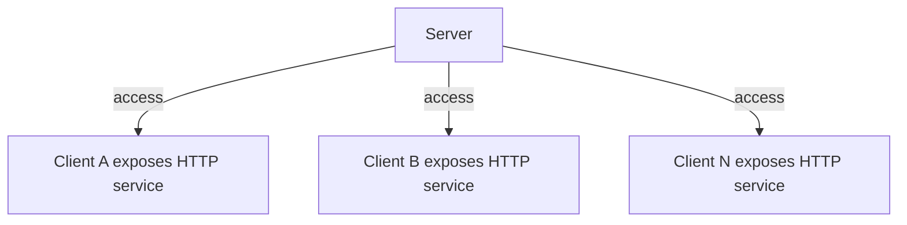
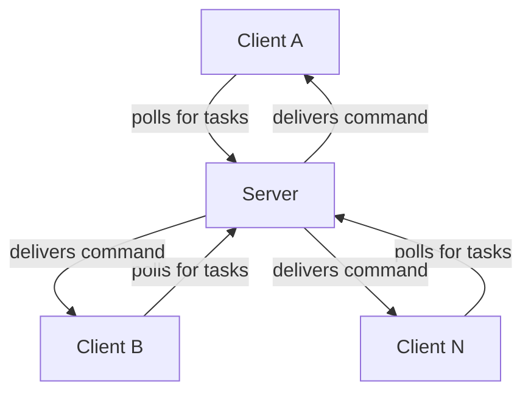

当然可以！下面是一篇适合技术博客发布的文章草稿，内容涵盖背景、痛点、方案对比、orange-forge-agent 的设计与优势、使用示例和适用场景，语言通俗易懂，适合开发者阅读。

---

# 高效安全的反向通信：orange-forge-agent 开源库介绍

在日常的 DevOps、自动化运维、批量任务下发等场景中，服务端如何高效、安全地向大量客户端下发指令，一直是个让人头疼的问题。今天给大家介绍一个开源 Go 库——**orange-forge-agent**，它用极简的方式解决了这一难题。

## 背景与痛点

在传统的 B/S 架构下，服务端通常通过 HTTP 服务与客户端（如浏览器、CURL、Python 脚本等）通信。这种模式下，客户端主动请求服务端，服务端响应即可，流程简单明了。

但在实际运维和自动化场景中，常常需要服务端主动下发指令到大量客户端，比如批量部署、健康检查、远程命令执行等。如果让每台客户端都暴露 HTTP 服务，服务端去主动访问，存在以下问题：

- **安全性差**：每台客户端都要开放端口，容易被攻击。
- **维护成本高**：端口管理、网络配置、权限控制都很繁琐。
- **分布式难度大**：服务端需要维护大量连接，排查问题复杂。

## 方案对比

为了解决服务端到客户端的反向通信，常见有两种技术路线：

1. **长连接（如 WebSocket）**
   - 优点：通信实时、流畅。
   - 缺点：分布式部署需引入连接管理，开发和运维复杂，异常排查困难。

2. **HTTP 轮询**
   - 优点：实现简单，服务端易于分布式扩展，无需复杂组件，排查问题容易。
   - 缺点：通信实时性依赖轮询频率，体验略有顿挫。

## orange-forge-agent 的设计思路

orange-forge-agent 采用了**HTTP 轮询**方案，客户端定时向服务端发起请求，询问是否有新任务。服务端只需响应，无需主动连接客户端。这样做有以下优势：

- **客户端无需暴露端口**，安全性高
- **服务端无状态**，易于扩展和维护
- **实现简单**，只需少量代码即可集成
- **适用场景广泛**，如批量任务、健康检查、远程命令等

### 对比流程图

**传统方式：**


> 每台客户端都需暴露端口，安全性和可维护性差

**orange-forge-agent 方式：**


> 客户端无需暴露端口，所有通信由客户端发起，安全易维护

## 快速上手

### 安装

```bash
go get github.com/zhuCheer/orange-forge-connect
```

### 服务端示例

以 Gin 框架为例，服务端只需绑定一个 API 路由，并注入 Redis 连接即可：

```go
func BindForgeServer() gin.HandlerFunc {
    return func(c *gin.Context) {
        conn := redisPool.Get()
        defer conn.Close()
        serverHttpHandler := ForgeServer.WithRdx(conn).Handler()
        serverHttpHandler.ServeHTTP(c.Writer, c.Request)
    }
}
```

### 客户端示例

客户端初始化后注册回调即可：

```go
service.ForgeClient = forge_connect.NewForge("appid", "secret").
    SetDebug(true).
    SetServerAddr("http://127.0.0.1:8890")

_, _, err := service.ForgeClient.Regist(CallbackTask)
if err != nil {
    // Error handling
}

func CallbackTask(task *forge_connect.Task) (result string) {
    // 处理任务
    return "done"
}
```

## 适用场景

- DevOps 自动化运维
- 批量任务下发
- 客户端健康检查
- 远程命令执行

## 总结

orange-forge-agent 用极简的方式实现了高效、安全、易用的反向通信机制，非常适合需要批量下发指令、自动化运维的场景。欢迎大家试用、反馈和贡献！

项目地址：[https://github.com/zhuCheer/orange-forge-connect](https://github.com/zhuCheer/orange-forge-connect)

---
