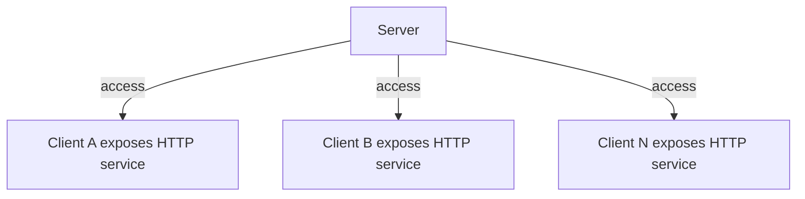
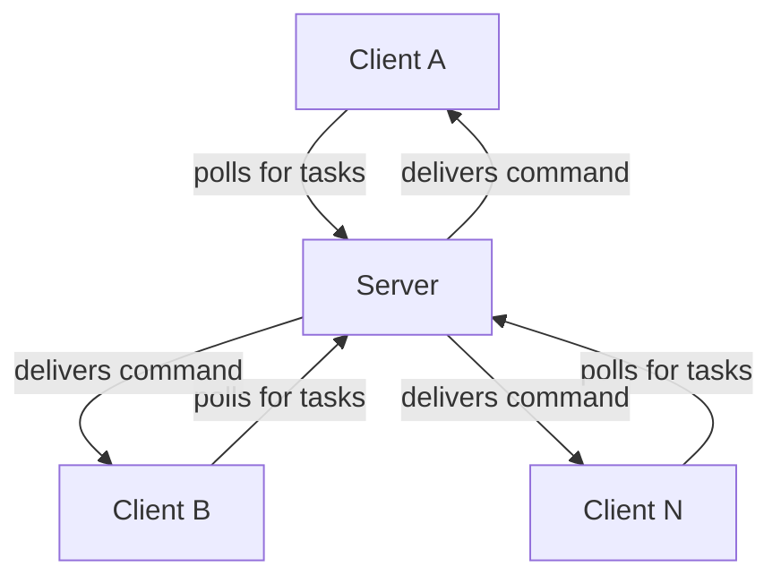

# Efficient and Secure Reverse Communication: Introducing the orange-forge-agent Open Source Library

In daily DevOps, automated operations, and batch task delivery scenarios, how can the server efficiently and securely send commands to a large number of clients? This has always been a challenging problem. Today, I’d like to introduce an open-source Go library—**orange-forge-agent**—which solves this problem in an extremely simple way.

## Background & Pain Points

In a traditional B/S (Browser/Server) architecture, the server usually communicates with clients (such as browsers, CURL, Python scripts, etc.) via HTTP services. In this model, the client actively requests the server, and the server responds—simple and straightforward.

However, in real-world operations and automation scenarios, the server often needs to actively send commands to many clients, such as for batch deployment, health checks, remote command execution, and more. If every client exposes an HTTP service for the server to access, several issues arise:

- **Poor security:** Every client must open a port, making it vulnerable to attacks.
- **High maintenance cost:** Managing ports, network configuration, and permissions is cumbersome.
- **Difficult to scale:** The server must maintain many connections, making troubleshooting complex.

## Solution Comparison

To solve reverse communication from server to client, there are two common technical approaches:

1. **Long Connection (e.g., WebSocket)**
   - Pros: Real-time, smooth communication.
   - Cons: Distributed deployment requires connection management, which is complex to develop and maintain, and hard to debug.

2. **HTTP Polling**
   - Pros: Simple to implement, easy to scale the server horizontally, no need for complex components, and easier to debug.
   - Cons: Real-time experience depends on polling frequency, so it may feel a bit laggy.

## The Design of orange-forge-agent

orange-forge-agent adopts the **HTTP polling** approach. Clients periodically send requests to the server to check for new tasks. The server only needs to respond and does not need to actively connect to clients. This brings several advantages:

- **Clients do not need to expose ports,** making it highly secure
- **The server is stateless,** easy to scale and maintain
- **Simple implementation,** requiring only a small amount of code to integrate
- **Widely applicable,** such as for batch tasks, health checks, remote commands, etc.

### Comparison Diagrams

**Traditional Approach:**


> Every client must expose a port, which is insecure and hard to maintain.

**orange-forge-agent Approach:**


> Clients do not need to expose any ports. All communication is initiated by the clients, making it secure and easy to maintain.

## Quick Start

### Installation

```bash
go get github.com/zhuCheer/orange-forge-connect
```

### Server Example

Using the Gin framework as an example, the server only needs to bind an API route and inject a Redis connection:

```go
func BindForgeServer() gin.HandlerFunc {
    return func(c *gin.Context) {
        conn := redisPool.Get()
        defer conn.Close()
        serverHttpHandler := ForgeServer.WithRdx(conn).Handler()
        serverHttpHandler.ServeHTTP(c.Writer, c.Request)
    }
}
```

### Client Example

After initializing the client, simply register a callback:

```go
service.ForgeClient = forge_connect.NewForge("appid", "secret").
    SetDebug(true).
    SetServerAddr("http://127.0.0.1:8890")

_, _, err := service.ForgeClient.Regist(CallbackTask)
if err != nil {
    // Error handling
}

func CallbackTask(task *forge_connect.Task) (result string) {
    // Handle the task
    return "done"
}
```

## Application Scenarios

- DevOps automation and operations
- Batch task delivery
- Client health checks
- Remote command execution

## Summary

orange-forge-agent provides an efficient, secure, and easy-to-use reverse communication mechanism with minimal code, making it ideal for scenarios that require batch command delivery and automated operations. We welcome you to try it out, give feedback, and contribute!

Project address: [https://github.com/zhuCheer/orange-forge-connect](https://github.com/zhuCheer/orange-forge-connect)

--- 
